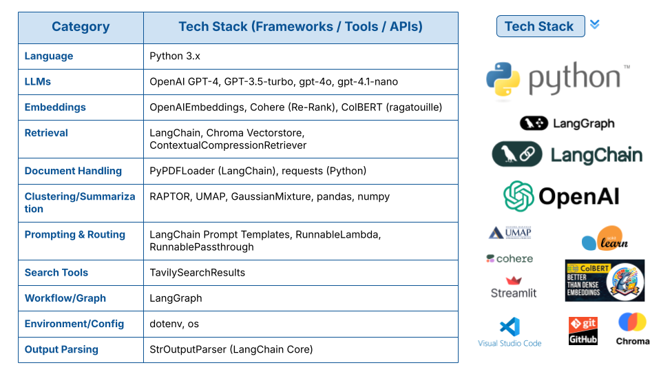

# Advanced-RAG-for-Finance-and-Market-Intelligence
---

[](https://www.python.org/)  
[](LICENSE)  

---

## 🎯 Business Challenge

-  My aim in this project is to optimize business intelligence in BFSI and Marketing by leveraging advanced     **Retrieval-Augmented Generation (RAG)** pipelines and domain-adapted LLMs to deliver faster, deeper, and more reliable insights. 
- By streamlining the retrieval, filtering, and synthesis of financial and market data from complex, large-scale document sources, my solution empowers organizations to make smarter, data-driven decisions with greater speed and confidence.

---

## 🏛️ Solution Architecture


---

## 🧠 Why Advanced RAG for Marketing & Finance?

* **Smarter Insights, Instantly:** Combines retrieval and LLMs to answer domain-specific queries with both precision and depth no more sifting through endless documents.
* **Enterprise-Grade Contextualization:** Tailors answers for business, finance, and marketing needs by routing queries to specialized context, boosting accuracy and relevance.
* **Trustworthy & Auditable:** Retrieves and synthesizes the latest data with transparent citations, supporting compliance, decision making, and stakeholder trust.


---
## 🔧 Advanced RAG Capabilities Overview :

| **Stage**                | **Role / Specialty**                         | **Main Parameters / Components**                                                   | **Special Functions / Tools**                                              |
| ------------------------ | -------------------------------------------- | ---------------------------------------------------------------------------------- | -------------------------------------------------------------------------- |
| **1. Query Translation** | Decompose & rephrase business questions      | - LLMs (GPT-4)<br>- Multi-query chain<br>- Sub-question generator                  | Converts complex prompts into focused, industry-aware sub-questions        |
| **2. Routing**           | Direct queries to specialized domains        | - Semantic routing<br>- Domain prompt templates<br>- Embedding similarity          | Chooses correct context (e.g., finance vs. marketing) for tailored answers |
| **3. Indexing**          | Structure and vectorize knowledge base       | - Semantic Splitter<br>- RAPTOR summarization<br>- ColBERT<br>- Chroma Vectorstore | Smart chunking, hierarchical summaries, industry-tuned embedding models    |
| **4. Retrieval**         | Retrieve, filter, and rerank documents       | - Cohere Re-Rank<br>- CRAG graph<br>- ContextualCompressionRetriever               | High-precision semantic search, multi-step grading, hallucination checks   |
| **5. Generation**        | Synthesize clear, grounded business insights | - Self-RAG graph<br>- LLM ensemble (GPT-4/GPT-3.5)<br>- Prompt templates           | Final synthesis, grounding, answer quality grading, hallucination filter   |


---

### **Evaluation Criteria & Metrics**

* **Domain/Business Accuracy:**
  Measures if the generated answers are not only factually correct, but also tailored to finance/marketing business context.

* **Retrieval Quality (Precision & Recall):**
  Evaluates if the RAG pipeline fetches the most contextually appropriate, up-to-date documents for each query. *( precision\@k, recall\@k)*

* **Reasoning Clarity:**
  Assesses the clarity and completeness of multi-step answers, especially for complex, multi-query or self-RAG chains. *(Measured by completeness and coherence scores via LLM evaluators/graders)*

* **Latency & Scalability:**
  Measures system response time and ability to handle high query volumes without degradation. *(Recorded as average response time and throughput under load tests - via langchain ecosystem)*

---

##  Complete Tech Stack



---


## 🏆 Project Goals

1. **Domain-Optimized Semantic Retrieval**

   * Index and retrieve finance/marketing content using advanced chunking, semantic embeddings, and re-ranking for business context.

2. **Multi-Query Decomposition & Synthesis**

   * Automatically break down complex queries into actionable sub-questions, aggregate multi-step answers, and synthesize comprehensive business insights.

3. **Context-Aware Prompt Routing**

   * Dynamically route queries and answers to domain-specific expert templates (e.g., banking, insurance, marketing), maximizing relevance and precision.

4. **Flexible, Extensible RAG Pipeline**

   * Modular workflow supporting rapid integration of new domains, retrievers (Chroma, ColBERT, Cohere), and generative models for future business needs.

5. **Business-Ready Output Delivery**

   * Deliver actionable, explainable, and source-cited insights for financial and marketing analysis, decision-making, and strategic planning.


---


## 🔧 Installation & Quick Start


### 1. Clone repo
```bash
git clone https://github.com/SindhePandurangBITS/Advanced-RAG-for-Finance-and-Market-Intelligence.git
cd Advanced-RAG-for-Finance-and-Market-Intelligence
```
### 2. Create & activate venv
```bash
python3 -m venv venv
source venv/bin/activate
```

### 3. Install dependencies
```bash
pip install -r requirements.txt
```
### 4. Start supporting services
- Create a `.env` file in the root directory.
- Add your `API keys (OpenAI, Cohere, LangChain, Tavily, etc.)` as shown in `utils/api_keys_env.py.`
### 5. Download & Prepare Data
```bash
python utils/download_and_load_pdfs.py
```
### 6. Run Main Pipeline (Jupyter Notebook)
```bash
jupyter notebook notebooks/advanced_rag(all_stages).ipynb
```
### 7. Run Queries Individually
```bash
assets\examples/queries.md
```
### 6. Launch the Streamlit Dashboard
```bash
streamlit run streamlit.py
```
---


## 📖 Documentation & Notebooks

Key workflows and use cases are demonstrated in the `notebooks` directory:

* **advanced\_rag(all\_stages).ipynb**
  *End-to-end pipeline demo: data loading, semantic splitting, advanced indexing (RAPTOR, ColBERT, Chroma), multi-query translation, semantic routing, retrieval (CRAG/Re-Rank), and answer generation for business intelligence in BFSI/Marketing domains.*

**What you’ll find:**

* Example queries and answers for finance, marketing, and business intelligence tasks.
* Step-by-step code cells for each pipeline stage (translation, routing, retrieval, generation, evaluation).
* Visuals of system architecture and tech stack in `assets/diagrams/`.

> For scripts covering each stage individually (e.g., indexing, retrieval, generation), see the `src/` folder.
> Configuration templates and environment variables can be found under `configs/` and `utils/`.

---
⭐ Support
If this project helped you, please ⭐ star the repository and share!

---

## 📑 Key References

1. **Retrieval-Augmented Generation for Knowledge-Intensive NLP Tasks**
   *Patrick Lewis et al., NeurIPS 2020*
   🔗 [Paper](https://arxiv.org/abs/2005.11401)

   > **Overview:** Introduces the RAG framework, combining neural retrieval with generative models for open-domain QA—forms the backbone of retrieval-augmented pipelines used in this project.

2. **ColBERT: Efficient and Effective Passage Search via Contextualized Late Interaction over BERT**
   *Omar Khattab & Matei Zaharia, SIGIR 2020*
   🔗 [Paper](https://arxiv.org/abs/2004.12832)

   > **Overview:** Presents the ColBERT method for scalable, high-quality neural retrieval—enabling semantic search and re-ranking in enterprise-scale RAG systems.

3. **LangChain Documentation: Building Applications with LLMs**
   *Harrison Chase et al., LangChain Docs, 2023*
   🔗 [Docs](https://python.langchain.com/docs/)

   > **Overview:** The official documentation for LangChain, providing best practices and advanced patterns for modular, composable retrieval and generation workflows.

4. **Cohere ReRank API Reference**
   *Cohere, 2023*
   🔗 [Docs](https://docs.cohere.com/docs/rerank)

   > **Overview:** Official documentation for Cohere’s neural re-ranking API, essential for fine-tuned, top-k document selection and advanced retrieval refinement.

---

